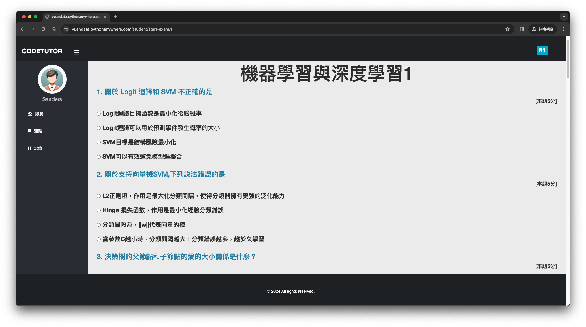
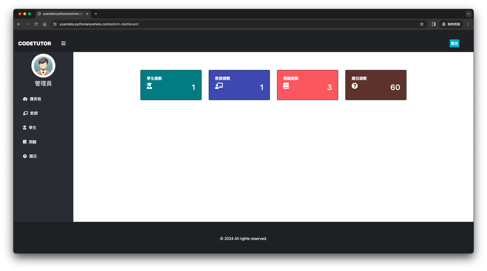
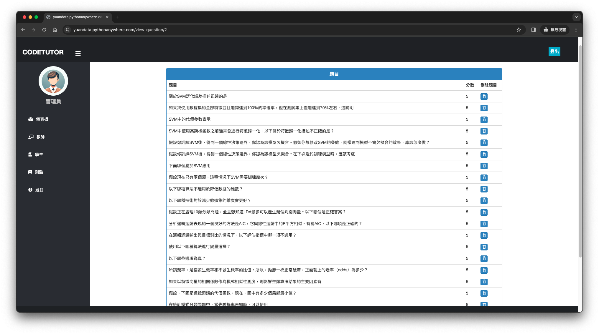

# 操作畫面
Demo網站: [https://yuandata.pythonanywhere.com](https://yuandata.pythonanywhere.com/)
## 測驗頁面

## 管理員主頁

## 編輯題目


# Django 設定說明
Django專案設定和啟動步驟。

## 環境設定

確保開發環境已安裝Python和Django。依照以下步驟安裝專案所需依賴包。

1. 依賴包安裝

   在終端機（命令提示字元）中，切換至專案目錄，執行以下命令安裝依賴包：

   ```bash
   pip install -r requirements.txt
   ```

## 資料庫設定

完成依賴包安裝後，進行資料庫設定。

1. 建立資料庫遷移

   執行以下命令，為模型建立新的資料庫遷移檔案：

   ```bash
   python manage.py makemigrations
   ```

2. 套用資料庫遷移

   執行以下命令，套用資料庫遷移以創建資料庫結構：

   ```bash
   python manage.py migrate
   ```

## 建立管理員帳號

為登入Django管理後台，需要建立管理員帳號。

執行以下命令並依照提示完成管理員帳號設定：

```bash
python manage.py createsuperuser
```

## 啟動開發伺服器

完成以上設定，可啟動Django開發伺服器運行專案。

執行以下命令啟動伺服器：

```bash
python manage.py runserver
```

伺服器啟動後，透過瀏覽器訪問 `http://127.0.0.1:8000/` 查看專案。
